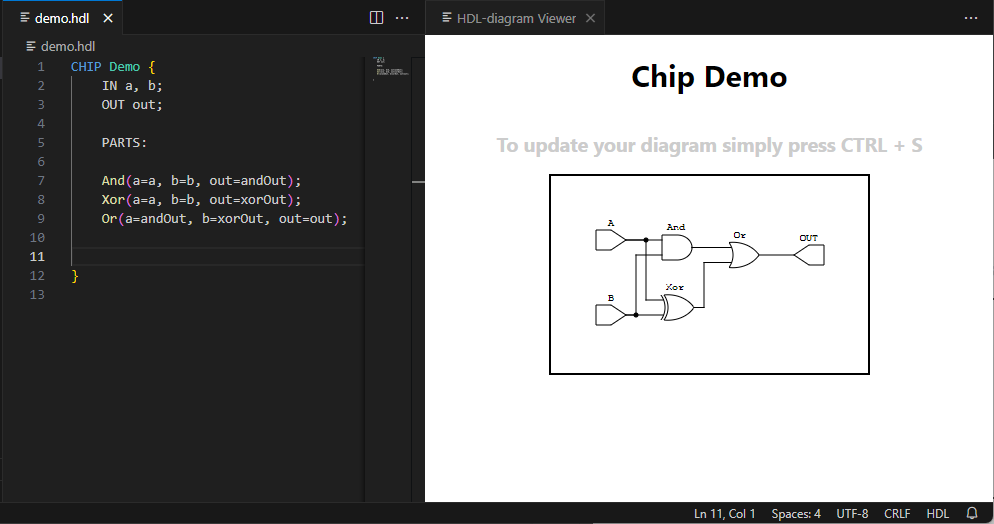

## Overview

Hdl-Diagram is a Visual Studio Code extension that provides real-time visualization of HDL (Hardware Description Language) files. This extension parses HDL files, converts them to a JSON representation suitable for yosys, and renders the circuit diagram as an SVG using in the VSCode panel.
we used Netlistsvg to create SVG diagram.

## Installation

first you need to install netlistsvg library globaly with the following command, or look in [Netlistsvg](https://github.com/nturley/netlistsvg).

we advice you to run VScode as administrator (Right Click + Run as administrator)
```sh
npm install Netlistsvg -g
```
1. download the Extension in VScode MarketPlace(Extensions), search "HDL-Diagram"

2. Or Run this command to install the code
```sh
git clone https://github.com/BenNahum6/hdl-diagram
```
after running this command, compile and run the code

## How to run

1. Press F1 or "CTRL + SHIFT + P" to open command search.
2. Search "Visualize HDL-Diagram" Command to run the extension.
3. Press "CTRL + S" to update your diagram.

## Photo



## License

open source.

**Enjoy!**
